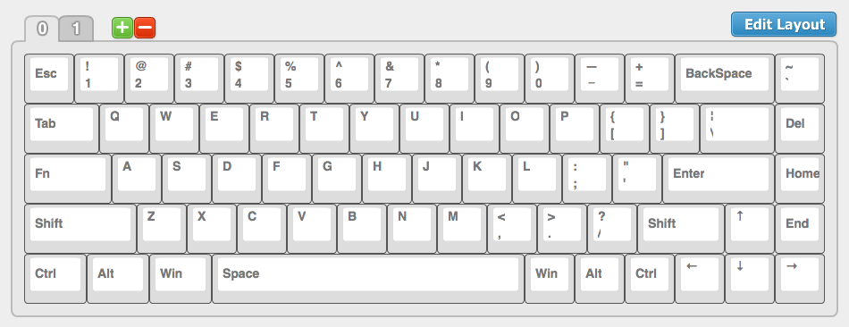
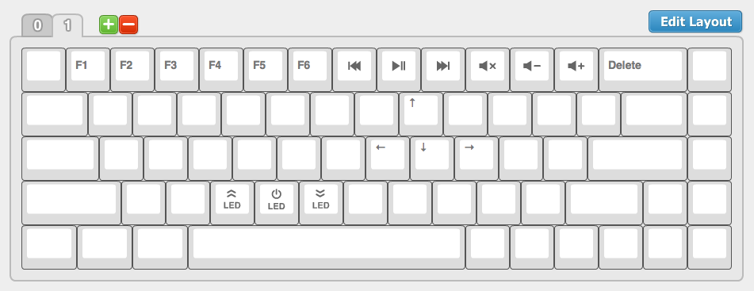

# Custom TADA68 Configuration for macOS

This repo documents my custom TADA68 setup for macOS and my personal preferences.


## Keyboard Layouts

This are [my layouts](http://123.57.250.164:3000/tada68#142F130B19E395C87B58262A5B99261C). The compiled `FLASH.bin` file can be found in the repository as well.

### Base Layer



### Second Layer




### Programming the keyboard

Programming the keyboard is done via [http://123.57.250.164:3000/tada68](http://123.57.250.164:3000/tada68) (requires Flash Player). [Here](https://cdn.shopify.com/s/files/1/0267/1905/files/TATA68-Manual-1.pdf) you can find the programming manual (an archived version can be found in the repository as well: `tada68_programming_manual.pdf`). When using the keyboard on macOS there are reports that the keyboard stops working after copying the `FLASH.bin` onto the keyboard. A solution was posted for example [here](https://www.reddit.com/r/MechanicalKeyboards/comments/520cov/using_an_originative_tada86_on_a_mac/). The necessary steps are:

1. Define the layout with the [editor](http://123.57.250.164:3000/tada68).
   When defining a key as a function key a drop down menu appears. Unfortunately this menu isn't translated. But a translation of the different options was provided [here](https://www.reddit.com/r/MechanicalKeyboards/comments/52totq/tada68_layout_editor_translation/). Those are in order from top to bottom:
    * No Operation
    * Momentary Press
    * Open / On
    * Closed / Off
    * Toggle
    * Momentary AND Press
    * Modifier
    * Combination Key
    * Tap Modifier Key
    * Toggle Modifier Key
    * Macro
2. Save the binary by clicking on the green button which is called `Compiler`.
3. Click the button on the bottom on the keyboard to enter programming mode, which then lets the keyboard appear as an usb drive.
4. Navigate to the usb drive in a terminal for example:
    ```bash
    $ cd /Volumes/TADA68\ \
    $ rm -rf .Trashes/ .fseventsd/ ._.Trashes ._FLASH.bin
    $ cp -r ~/Desktop/FLASH.bin /Volumes/TADA68\ \
    ```
5. Eject the usb drive.
6. Now your keyboard should be working again.
