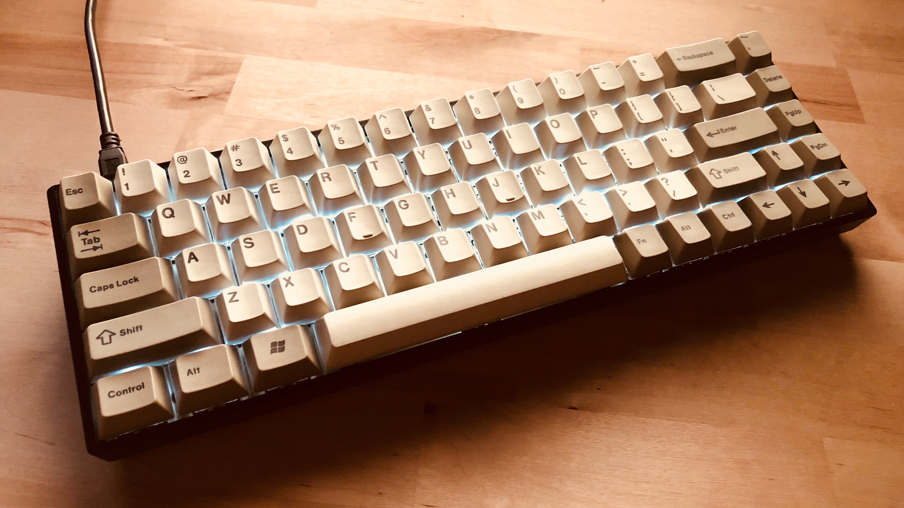
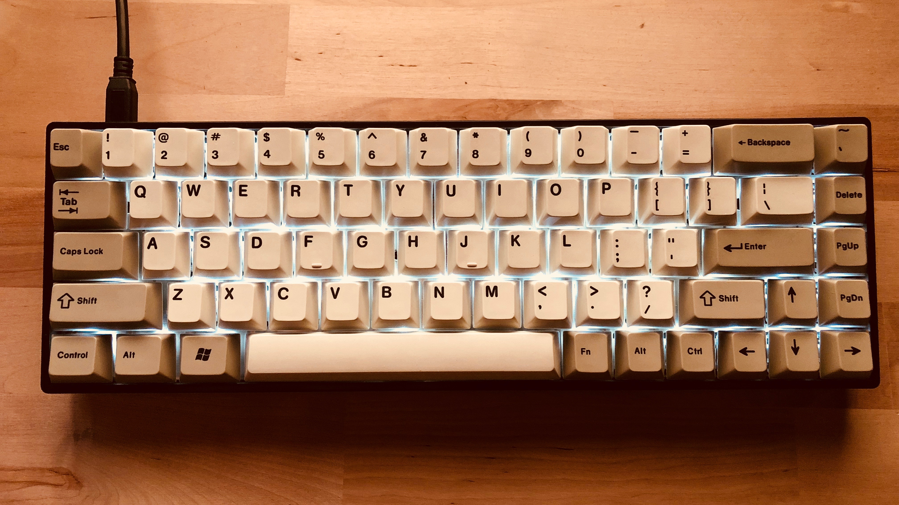

# Custom TADA68 Configuration for macOS

This repo documents my custom TADA68 setup for macOS, my personal preferences and a little bit of documentation on how to program/customize a TADA68 keyboard.

* [Keyboard layouts](/setup/keyboard_layouts.md)
* [Programming the keyboard](/docs/programming_the_keyboard.md)

## Current setup

## Credits

Here are some sources I used to collect all the informations and where I found inspiration for my setup:

* https://github.com/ravicious/TADA68
* https://www.reddit.com/r/MechanicalKeyboards/comments/54a6n5/tada68_keycaps_size_for_dummies/
* https://imgur.com/gallery/BfWN8