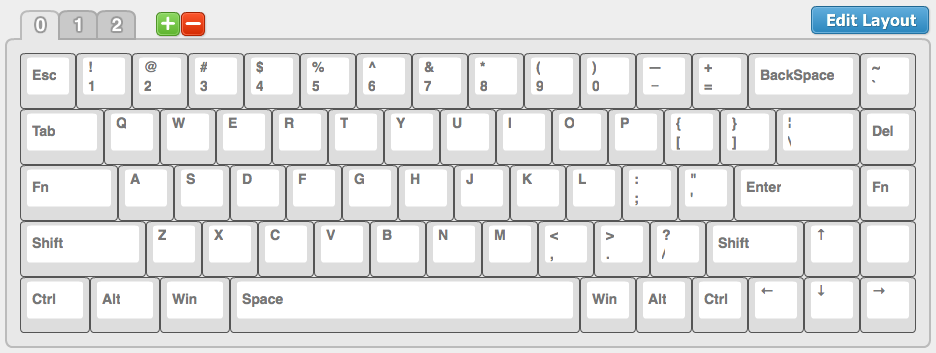
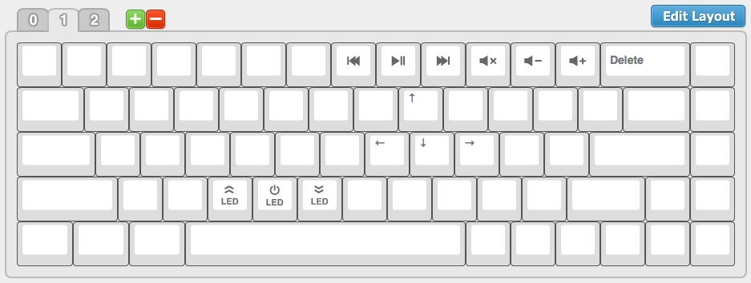
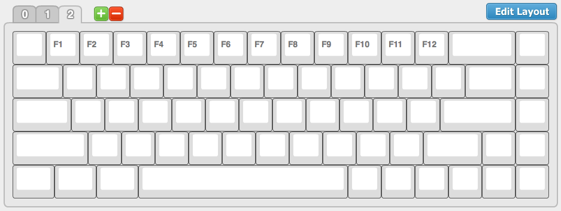

## Keyboard Layouts

This are [my layouts](http://123.57.250.164:3000/tada68#C228C8C3E2578DE047339D8C742FC040). The compiled `FLASH.bin` file can be found in the repository as well.

### Base Layer

### Second Layer

### Third Layer

